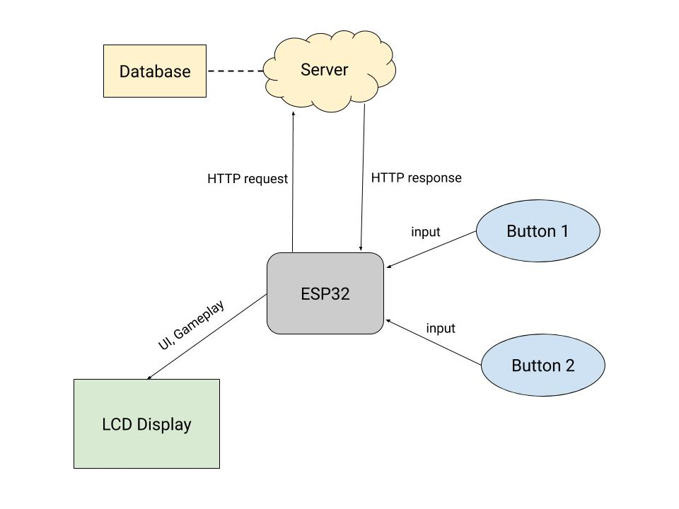

## MIT 6.08 Spring 2020: ESP32 Battleship

[Final Write-Up](../images/608_game/Final-Write-up.html)

For the 6.08 final project, my team decided to take the classic battleship game, and innovate with multi-player, new game mechanics, and new move types.  The game boards were all stored on a server, and users would interact through the UI on the ESP32.  Players would place their ships, shoot each other's boards, and modify their own boards with a small ESP screen and buttons, while the server would ensure that the moves were handled appropriately.  

My contribution the the game was mostly on the server side.  I implemented SQLite extensively and set up a safe python POST/GET framework for the ESP and server to communicate together via JSON.  All turn updates and game creation was done on the server, while the rendering, ship placement, moves decisions, and menus were handled in C++ Arduino code.  One group member, Niklas Mannhardt, did extensive work on the ESP and entire project to make this all happen.

Below is a system diagram of the project, but the full write-up can be found [here](../images/608_game/Final-Write-up.html).

    

