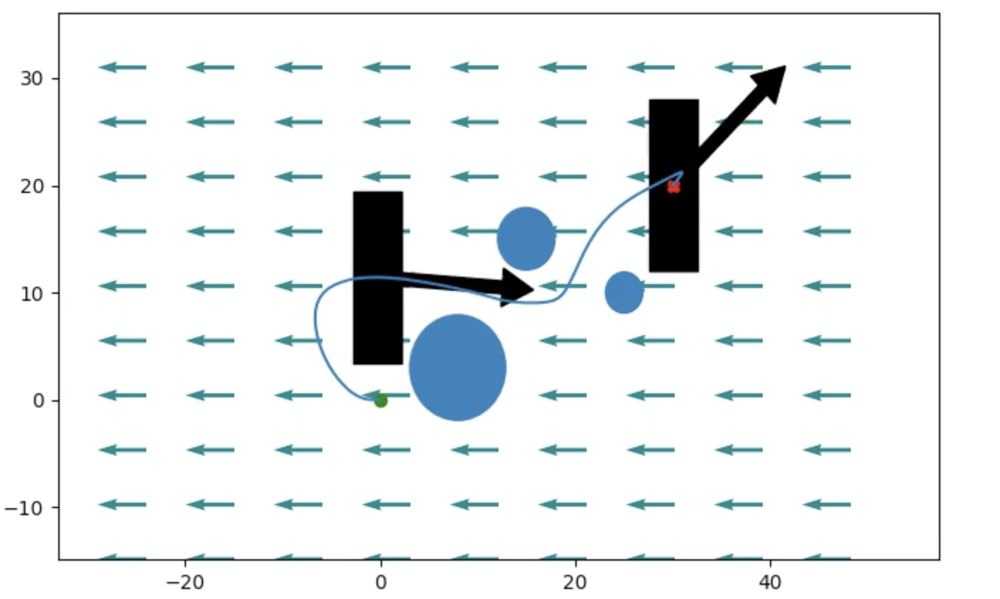
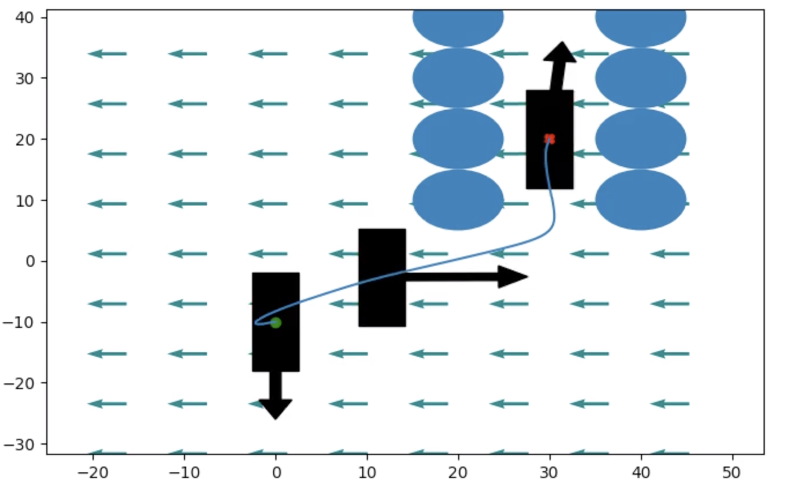

## Trajectory Optimization on an Autonomous Boat

Credit for this writeup goes to my wonderful project partner: [Eric Chen](https://echen9898.github.io)

**Resources:** [code](https://github.com/echen9898/docking), [report](https://www.dropbox.com/s/bzybarkl64ms1fe/6_832_Final_Project.pdf?dl=0), [video](https://www.youtube.com/watch?v=8AD0oO6Yoag)

[6.832 (Underactuated Robotics)](http://underactuated.csail.mit.edu/Spring2020/index.html) is a graduate class at MIT that explores nonlinear control of various robotic system. For the final project, we derived the planar dynamics of a simple motorboat and successfully generated paths with moving obstacles in a variety of current flows using trajectory optimization. The project was implemented using [Drake](https://drake.mit.edu/), and we experimented with both [Snopt](https://ccom.ucsd.edu/~optimizers/solvers/snopt/) and [Ipopt](https://github.com/coin-or/Ipopt) solvers. For a detailed description of the dynamics and the optimization formulation, checkout the report or video above.

Given the same optimization formulation, each of these solvers produced very similar solutions for simple scenarios but diverged in more complex current fields. While the success of either method is dependant on the current field, any obstacles, and your desired start and goal configurations, we found that in a large majority of situations the Drake implementation of Ipopt performed better than the Drake implementation of Snopt. Below is an example of a simple trajectory returned by Ipopt.

    

By adding constraints on the boats distance from obstacles Ipopt is able to generate smooth paths through both static and moving obstacles, as shown below.

    

While we did experiment with costs on fuel consumption and distance covered, even relatively simple formulations with constraints on the boats dynamics and torques resulted in reasonably efficient trajectories like the docking maneuver pictured here.

    

This project was only a few weeks long, and there are definitely a variety of interesting directions to pursue further. We hope to get around to working on those a bit more.