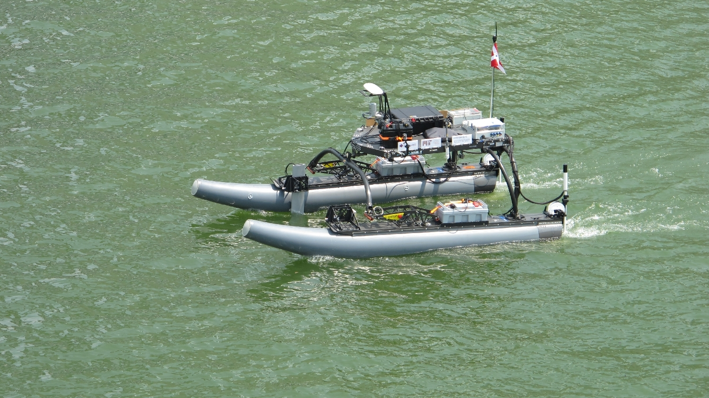

<h3><strong>MIT REx - Vision Summer 2018</strong></h3>

 

Boats have had accurate RADAR and GPS-guided autopilot for many decades, but full unmmanned autonomy is a heavily researched area.  As the technology matures, unmmaned surface vehicles (USVs) can provide everythning from lower-cost, long-term data collection in the most remote regions of the world to efficient and safer cargo transport.  One area I'm particulartly interested by is aquaculture, farming in the oceans. As the global demand for food increases and arable grows scarce, moving to the vast and nutrient rich waters can provide a much needed boost in sustainable food production.  Doing this, however, requires rethinking water transport, and autonomous boats may be a key part of the answer.

I spent my summer working on the REx (Remoted Explorer) USV in the MIT Pavlab as a MIT SeaGrant student researcher.  REx is a WAM-V vessel specifically designed for autonomous applications, and my work centered around the ongoing Boston Harbor RoboChallenge project, which is a competition focused on producing a vehicle capable of navigating autonomously down the Charles River into the Boston Harbor for research tasks. Successfully navigating the river and harbor autonomously would be a huge benefit to commercial platforms and marine research, as it makes remote areas or long-term research more accessible.

A report on my individual projects on battery monitoring and stoplight detection can be found [here](../images/REx/IsaacPerper_SummerFinalReport.pdf), although additional work was done to support deploying REx for tests, collecting data on trips to the Boston Harbor, and other lab work.