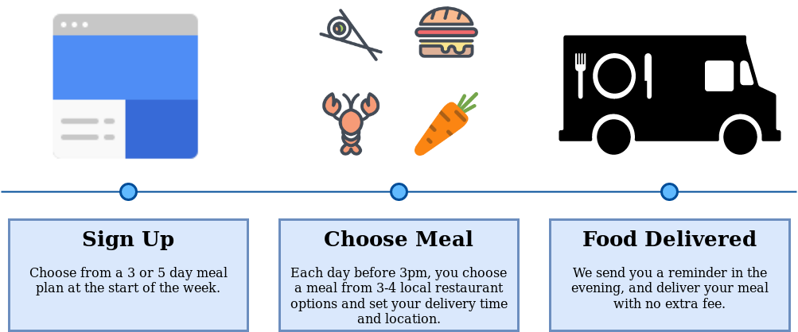

### **Food Delivery: Winter 2018**

Although the numbers weren't adding up for drone delivery, the Astral team was still motivated by problems in optimization and issues we could relate to.  Food delivery had been a hot topic for a while by the time we looked into it, but the new industry still had a lot of issues, which we explore below.

**Problem:**

Students and busy professionals have limited options for getting convenient meals at an affordable price. Eating out at a restaurant every night of the week is costly and time-consuming. While cooking at home is affordable, it requires substantial planning and preparation time. Although delivery services offer convenience, they typically add 30-40% to the cost of an already pricey restaurant meal and often a driver is dispatched to deliver a single meal - a wasteful and expensive endeavor. 

On the other hand, restaurants find it difficult to deliver meals on their own due to high capital costs and time-consuming operations, which leads them to utilize third party services that take a significant cut of the purchase. To grow their customer base and stay competitive, restaurants are forced to accept noticeably lower margins on their food. Services like UberEats take a 10-30% cut from restaurants without providing any guarantees about the timing and volume of orders in advance. 

Additionally, 15% of national food wastage comes from restaurants, and up to 10% of the food restaurants buy ends up in landfills. Without knowing how many customers they are going to have, or even what they are going to order, this inefficiency is necessary to meet highly variable demand.

**Solution:**

We are working to create a platform where students and young professionals can subscribe to an affordable meal plan delivery service selected from local restaurants with no additional fees. After signing up for a weekly plan, customers can choose their meal each day through our website menus or via app. Once confirmed, they receive updates on meal progress as the delivery time approaches.

By purchasing meals in bulk on pre-arranged days of the week, we offer restaurants a consistent and predictable flow of customers. This allows them to plan staffing and ingredients ahead of time, taking advantage of slow hours and reducing resource wastage. Additionally, our platform can run analytics into ideal portion sizes, optimize delivery routes to avoid the environmental effects of single order deliveries, and donate excess meals to local food banks or cheap last minute deals. Finally, our platform gives restaurants an opportunity to reach a large and growing customer base without sacrificing margins.

**Key Facts:**

1. Food delivery market is about $96B USD or 1% of total food market, and 4% of food sold via restaurants and fast food chains (McKinsey).

2. Despite higher costs of maintaining delivery drivers and vehicles, new players in the food delivery market achieve EBITDA margins of around 30% (McKinsey).

3. Time is critical: Speed is the biggest variable in customer satisfaction with 60% of customers citing it as a key factor (McKinsey).

4. Meals are for home: Most orders (82%) were placed from home while only 16% were placed from the workplace (McKinsey).

5. Orders spike on weekends: The highest-volume days for the online platforms are Friday, Saturday, and Sunday when 74% of all orders are placed (McKinsey).

6. The average profit margin for a restaurant is under 30%. Fast food such as McDonalds reported profit margins about 22% in 2017. Casual dining or family style restaurants have a profit margin between 5% to 10%. Lastly, full-service restaurants such as fine-dining have average profit margins of about 6.1% (Forbes).

**Sources:**

1. Forbes, Why UberWill Eat You Into Bankruptcy, March 26, 2018.
2. McKinsey, The Changing Market for Food Delivery, November 2016.

