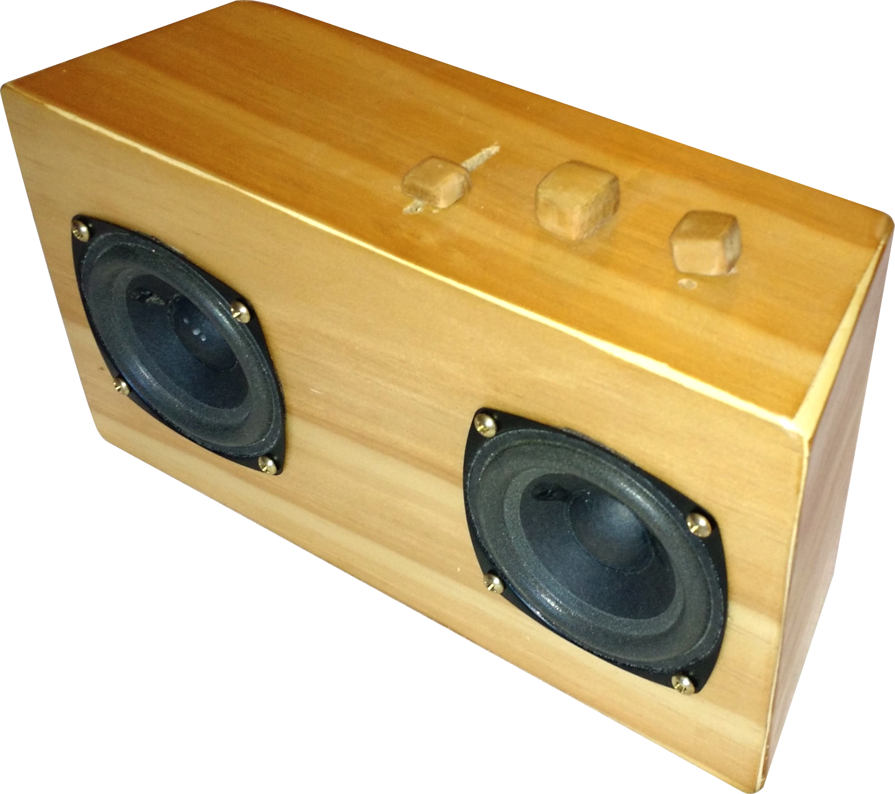

	<h3><strong>Bluetooth Speaker: 2014</strong></h3>
 

 

Similar to my dodecahedron lamp, I have always been fascinated by wood grain in modern product (I remember getting the bamboo back for my first MotoX). With this project, my goal was make a portable speaker that also looked good, as most speakers on the market were boring plastic designs.

I first started by designing the speaker system, so that the box would contain the correct functionality. The majority of the components came from a 5V speaker system I had disassembled.  From there, I added a bluetooth module in parallel with the line-in source, such that I could use either input.  The bluetooth module was wired to a seperate switch to conserve battery when it was not in use.

I then tried to setup a built in LiPo rechargeable battery system. Since the system ran at around 5V, I needed by two 2.7V LiPos to run the system in series, but the battery charing module would only charge in parellel.  I wired DPDT switch to accomplish this, however I could not get the charging board to function correctly.  The final product was powered from a bank of 4 AA batteries that have to get replaced every so often.  There is also a DC-in port on the back to run the device from a wall outlet.  The battery vs. DC-in power is also selected via a switch.

For the case, I envisioned a tapered box similar to a loud speaker shape.  I was partially limited by tools, only have a skillsaw to cut out the small pieces, but I was able to sand the edges to a more accurate bevel.  From the scrap wood I crafted switch covers for the volume, power on, and bluetooth switch.  On the back I added a permanent line-out cord (so you don't have to remember and aux cable), and the DC power port.

The whole device is rather heavy, as it uses solid wood, but this makes for a sturdy design.  The pieces were glued together, and interior wood corner braces further reinforce the design.  I generally use this speaker in the backyard or for trips to the beach, although it will need to be sealed better to protect from dust and water.