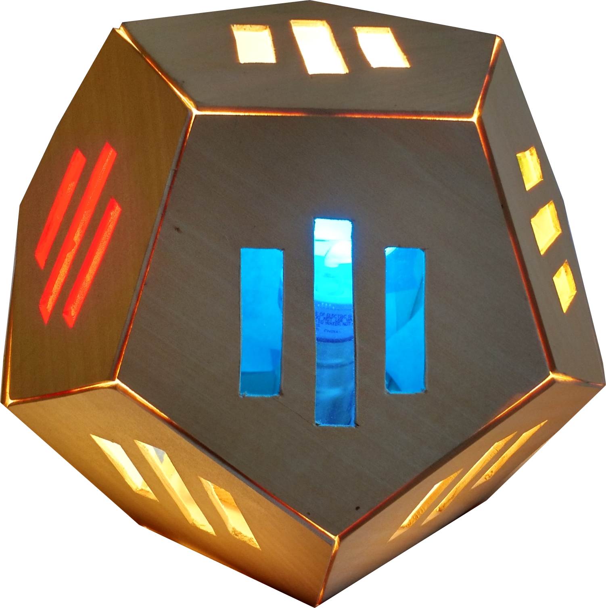

### **Dodecahedron Lamp: 2012-2014**

&nbsp;

	<figure class="project">
		
	</figure>

This project started in my 8th grade art class, but I never got around to fully finishing it until a few years later.  I'm fascinated by modern lamp designs made out of wood, which influenced this project.  Using my experience with balsa wood from building model planes, I purchase 1/8" balsa and began cutting out the pentagons from my stencil. From there, clamped them all together and sanded the edges to get near-perfect shapes.

At first, I had planned on beveling the edges to make a flush fit, but after holding up to edges to the light, I thought the light shining through the cracks created a more interesting effect. Ideally, this lamp would mount sideways on a wall like a sconce fixture, but it can also mount to a ceiling or be used as a desk lamp.  The different colors make it more artistic than functional, but they could also be switched out for white paper.

