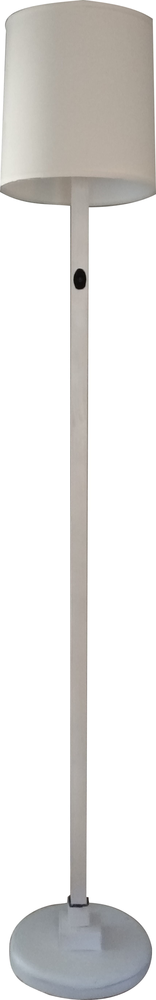

<h3><strong>Wood Floor Lamp: Summer 2015</strong><h3>

  

	

And another lamp project... This time I needed a floor lamp more out necessity, as my new room didn't have any over head lighting.  While brainstorming, I decided on a sleek design with a small weighted base. I haven't fully finished yet, as my goal is to sharpie on black and white patterns, with inspiration drawn from local artist Zio Ziegler.

The first big part of the project was cutting a 2x2 wood beam precisely in half (as precise as you can be with a power saw), and then routing out a roughly half inch grove for all the wiring.  Near the switch, I had to cut all the way through to leave enough room for the DPDT wiring and switch, and the lamp has one bulb and three bulb on settings. For the base, I braced on a ten pound weight for ballast, and the covered up the bottom with balsa wood I soaked and then molded into a circle.  Though it would have much easier to create the whole lamp out of metal piping, wood is my favorite material and I could craft it into the exact shapes I wanted.

