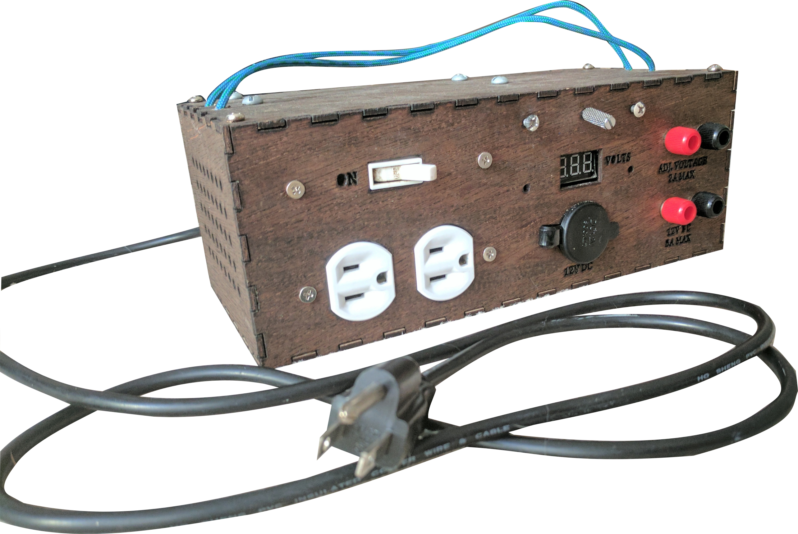
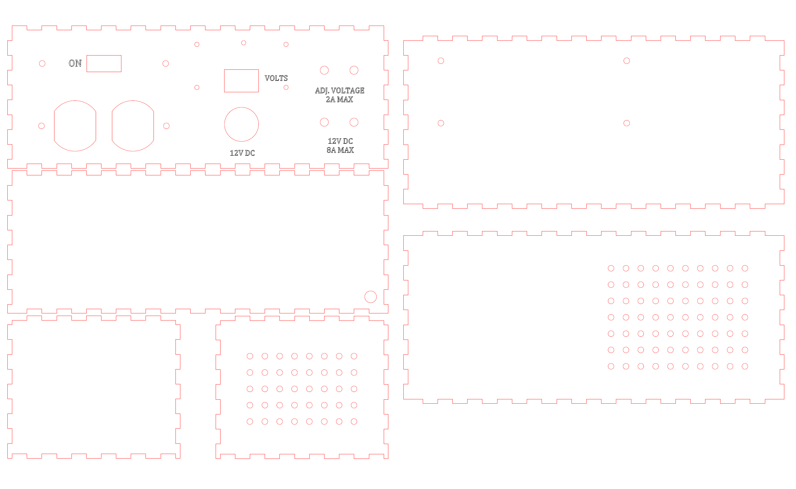

### **Hobby Power Supply: Spring 2016**

&nbsp;

	<figure class="project">
		
	</figure>

&nbsp;

As I began to work with more circuits and electronics, I decided it was time to get a dedicated power supply for testing my various projects.  I had a several old computer power supplies left over, so I designed a box to contain all the power needs I required.  The criteria: on/off switch, 120V outlets, 12V DC outlets, dedicated 12V DC banana plugs, and adjustable 2-12V banana plugs. The adjustable voltage came from a regulator I ended up not using on a previous project.

	<figure class="project">
		
	</figure>

&nbsp;

The max current on the DC system is 8A, which is more than enough for most of my work, and so far it's worked beautifully for testing my micro-controller systems, motors, and much more.  The casing was laser cut and then stained out of some scrap wood, and I grounded the whole system inside to prevent sparks during a surge.  Although it hasn't overheated yet, I left space for a fan to push air out of the holes in the casing wall, so I can add this if heat ever becomes an issue.

	<figure class="project">
		
	</figure>

