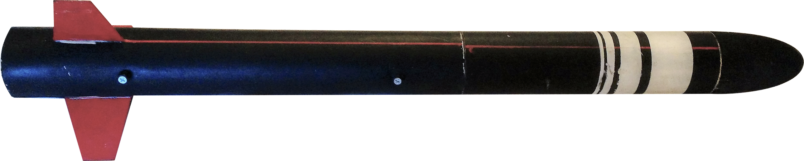
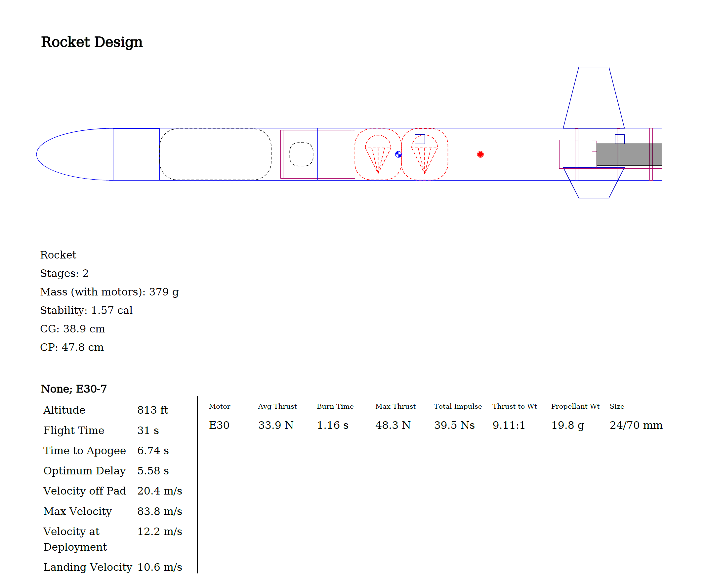
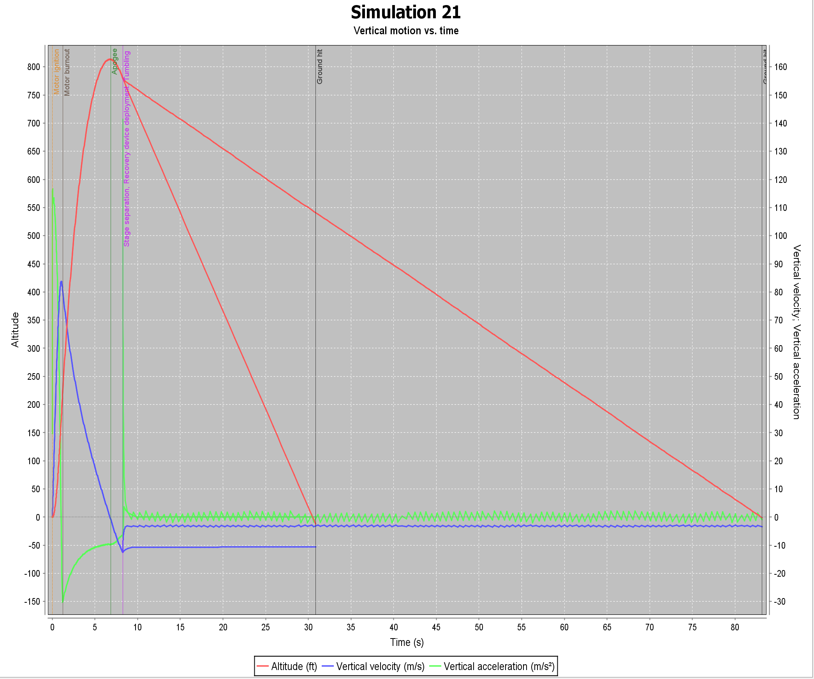

#### Team America Rocketry Challenge Rocket: 2015-2016

	<figure class="project">
		
	</figure>

Starting junior year of high school, I worked with a team of 5 friends to design and construct a rocket for the national TARC competition - eventually place 9th in the nation out of a few hundred teams.

The journey began in our high school science classroom, meeting our outstanding mentor Ken Biba.  Ken is an accomplished amateur rocketeer, and truly lead us on the path to success. Using his expertise, along with knowledge from classes and previous model rockets, we set out to create a rocket to carry an egg to 800 feet, and return it safely to the ground within a total flight time of 46-48 seconds. 

An open source software called OpenRocket allowed us to simulate different design iterations, testing the effect of fins shape, weight, tube diameter, and parachute size on the flight of the rocket. For our first prototype, we concluded on trapezoid fins, which are optimal for sub-sonic flight, the narrowest tube diameter we could be the egg in to minimize drag, and a low weight to give us maximum options for rocket motor choice.  

	<figure class="project">
		
	</figure>

	<figure class="project">
		
	</figure>

After CADing and laser cutting the fins and centering rings, we constructed the rocket over a few weekends and had a successful first flight. In fact, the only change we made to the final design was decreasing the fins size to further reduce drag, while still maintaining sufficient stabilization.

In our first year in the contest, we qualified for nationals with a best flight of 805 feet and 46.65 seconds, and ended up placing ninth overall at nationals.  Due to our success that year, we competed again the following year and expanded into three total teams at our high school.